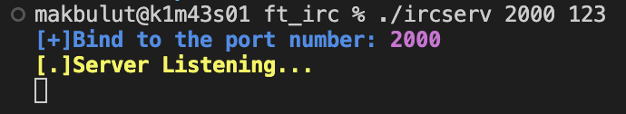
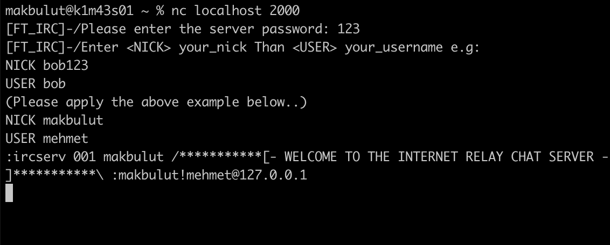

<!-- # ft_irc
Create your own IRC server in C++, fully compatible with an official client.

# Fonksiyonlar
<br> -->

<!--|---
|socket
|---
|setsockopt
|---
|getsockname
|---
|getprotobyname
|---
|gethostbyname
|---
|getaddrinfto
|---
|freeaddrinfo
|---
|bind
|---
|connect
|---
|listen
|accept
|---
|htons
|---
|htonl
|---
|ntohs
|---
|nthol
|---
|inet_addr
|---
|inet_ntoa
|---
|send
|---
|recv
|---
|signal
|---
|lsekk
|---
|fstat
|---
|fcntl
|---
|poll-->

<!-- ### 1. Socket creation:
```
int sockfd = socket(domain, type, protocol)
```
sockfd: socket descriptor, an integer (like a file-handle)
domain: integer, specifies communication domain. We use AF_ LOCAL as defined in the POSIX standard for communication between processes on the same host. For communicating between processes on different hosts connected by IPV4, we use AF_INET and AF_I NET 6 for processes connected by IPV6.
type: communication type
SOCK_STREAM: TCP(reliable, connection oriented)
SOCK_DGRAM: UDP(unreliable, connectionless)
protocol: Protocol value for Internet Protocol(IP), which is 0. This is the same number which appears on protocol field in the IP header of a packet.(man protocols for more details)
### 2. Setsockopt:

This helps in manipulating options for the socket referred by the file descriptor sockfd. This is completely optional, but it helps in reuse of address and port. Prevents error such as: “address already in use”.
```
int setsockopt(int sockfd, int level, int optname,  const void *optval, socklen_t optlen);
```
### 3. Bind:
```
int bind(int sockfd, const struct sockaddr *addr, socklen_t addrlen);
```
After the creation of the socket, the bind function binds the socket to the address and port number specified in addr(custom data structure). In the example code, we bind the server to the localhost, hence we use INADDR_ANY to specify the IP address.

### 4. Listen:
```
int listen(int sockfd, int backlog);
```
It puts the server socket in a passive mode, where it waits for the client to approach the server to make a connection. The backlog, defines the maximum length to which the queue of pending connections for sockfd may grow. If a connection request arrives when the queue is full, the client may receive an error with an indication of ECONNREFUSED.

### 5. Accept: 
```
int new_socket= accept(int sockfd, struct sockaddr *addr, socklen_t *addrlen);
```

It extracts the first connection request on the queue of pending connections for the listening socket, sockfd, creates a new connected socket, and returns a new file descriptor referring to that socket. At this point, the connection is established between client and server, and they are ready to transfer data.

Stages for Client
Socket connection: Exactly same as that of server’s socket creation
Connect: The connect() system call connects the socket referred to by the file descriptor sockfd to the address specified by addr. Server’s address and port is specified in addr.

https://www.tutorialspoint.com/unix_sockets/what_is_socket.htm -->

# ft_irc (Internet Relay Chat Server)

### Server Running Command

```
make

./ircserv [PORT] [PASSWORD]

````



---

#### Client

You can choose ready irc client for client. KVIRC will be the best of them. You can also connect with netcat (nc).

[KVIRC](http://www.kvirc.net/)
```
nc [IP] [PORT];
```

<!--  -->


## Commands

```
HELP 

JOIN [#CHANNEL]

PRIVMSG [#CHANNEL] : [MESSAGE]

PRIVMSG [NICK] : [MESSAGE]

KICK [#CHANNEL] [NICK]

NOTICE [#CHANNEL] : [MESSAGE]

QUIT 
```

